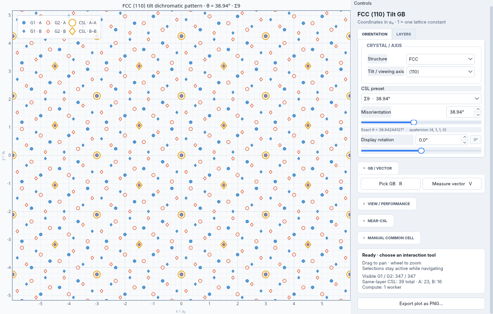

# DichromaticMap user guide

[中文](../zh/README.md) · [Project home](../../README.md) · [Implementation details](development.md)

DichromaticMap includes a numerical Python library and an interactive viewer for
SC/FCC/BCC tilt grain-boundary dichromatic patterns. It displays two grains by
axial layer and supports exact coincidence sites, local near-pair matching,
vector measurements, atom counting, uniform-strain common cells and PNG export.

GUI guide: [Overview](#gui-overview) · [First session](#gui-quick-start) ·
[Crystal and orientation](#gui-orientation) · [Layers](#gui-layers) ·
[Navigation](#gui-view) · [GB reference](#gui-boundary) · [Vectors](#gui-vector) ·
[Near-CSL](#gui-near-csl) · [Manual cells](#gui-manual-cell) ·
[Selected-cell strain](#gui-selected-strain) · [Export](#gui-export) ·
[Troubleshooting](#gui-troubleshooting).

## Installation and launch

Requires Python 3.10 or later. Download the project and run the following from
its root directory to install the library and viewer:

```bash
python -m pip install ".[gui]"
python -m dichromatic_map
```

The numerical library requires NumPy; the viewer additionally uses PySide6 and
PyQtGraph. For numerical use only, install with `python -m pip install .`.
`dichromatic-map` is an equivalent viewer command. From the project root,
`python main.py` also launches the viewer.

```bash
python -m dichromatic_map --lattice SC --axis 100
python -m dichromatic_map --lattice BCC --axis 100
python -m dichromatic_map --axis "1 -1 3" --workers 4
python -m dichromatic_map --help
```

All plot coordinates, view dimensions and matching distances use a₀, the
reference lattice constant. A coordinate of 1 means one lattice constant.
The lattice-constant setting supplies its value in Å without changing the
normalized plot coordinates.

The three supported cubic Bravais lattices are simple cubic (`SC`), face-centered
cubic (`FCC`, the default) and body-centered cubic (`BCC`). Preset ⟨100⟩, ⟨110⟩,
⟨111⟩, ⟨112⟩ axes and custom integer axes are supported. Each geometry has its
own axial layers and repeat distance. These are point lattices with one atom
per primitive cell; additional multi-atom bases, such as diamond, are not supported.

For SC along a reduced integer axis [h k l], one axial repeat contains h²+k²+l²
layers. The repeat length is a₀√(h²+k²+l²), and the layer spacing is
a₀/√(h²+k²+l²). Thus SC [100], [110], [111] and [112] have 1, 2, 3 and 6 layers,
respectively. SC [100] shows only layer A. Matching, cell counting and strain
operations use the same layer rules for all three lattices.

### Command-line options

| Option | Meaning and default |
| --- | --- |
| `--lattice` | `FCC` (default), `BCC` or `SC` |
| `--axis` | Integer axis, default `110`; quote separated signed/multi-digit indices, e.g. `"1 -1 3"` |
| `--angle` | Reference misorientation in the selected axis range: ⟨100⟩ 0–45°, ⟨110⟩ 0–90°, ⟨111⟩ 0–60°, other cubic axes 0–180°; default Σ9 for `110`, Σ5 for `100`, lowest-Σ preset for other axes, or 0° if none exists |
| `--lattice-constant` | Reference a₀ in Å, default 3.52 |
| `--width`, `--height` | Base view dimensions in a₀, default 12 and 9 |
| `--marker-size` | Atom marker size parameter, default 32 |
| `--view-scale` | Initial field-size multiplier, 0.1–5, default 1 |
| `--workers` | Calculation processes, default up to 4, limited by available CPUs; use 1 for a single process |
| `--save` | Export the initial plot to PNG and exit |

### PNG export

```bash
python -m dichromatic_map --angle 22 --save pattern.png
```

For PNG export without a display server, set `QT_QPA_PLATFORM=offscreen`. In a
shell that supports inline environment variables:

```bash
QT_QPA_PLATFORM=offscreen python -m dichromatic_map --workers 1 --save pattern.png
```

The viewer's `Export plot as PNG…` button saves the current plot, including
display rotation and annotations.

<a id="gui-overview"></a>

## GUI overview



FCC ⟨110⟩ at the Σ9 preset, with the plot on the left and controls on the right.

The scrollable `Controls` panel is on the right. Switch the tabs at the top to
move between `ORIENTATION` and `LAYERS`. Click a section heading to expand or
collapse it. `GB / VECTOR` starts open; `VIEW / PERFORMANCE`, `NEAR-CSL` and
`MANUAL COMMON CELL` start collapsed. Scroll down to reach the status card
and export button.

| Area | Use it to |
| --- | --- |
| `ORIENTATION` | Choose FCC/BCC/SC, a viewing axis, a CSL preset or a custom angle; rotate the display |
| `LAYERS` | Show individual G1/G2 axial layers and the automatic common cell |
| `GB / VECTOR` | Pick a GB reference line, clip either grain to its sides, or measure a vector |
| `VIEW / PERFORMANCE` | Adjust field size, centering and grain reference axes in `VIEW`; change `CPU workers` in `PERFORMANCE` |
| `NEAR-CSL` | Enable local near-pair matching or search for a strained periodic cell |
| `MANUAL COMMON CELL` | Select four common sites, count atoms, and optionally apply selected-cell strain |
| Status card | Read the next picking instruction, visible atom/CSL counts, and calculation status |

The status card counts points in the current view. The manual-cell panel counts
the complete selected polygons, so the two totals answer different questions.

| Plot marker | Meaning |
| --- | --- |
| Blue filled atoms / orange-red outlined atoms | Grain 1 (G1) / Grain 2 (G2) |
| Circle, diamond, triangle and other shapes | Axial layers; match the shape and layer name to the legend or `LAYERS` checkboxes |
| Gold markers | Same-layer exact CSL sites |
| Purple midpoint markers and short dotted links | Local near pairs and their actual atom endpoints |
| Teal dashed outline | Automatic common periodic cell, when enabled and available |
| Blue G1 / orange G2 arrows at the lower left | Perpendicular in-plane grain reference directions, labeled `[uvw]` |
| B1–B2 and a dark line | Picked GB reference and its left/right sides |
| P1–P2 and a purple arrow | Measured vector |
| C1–C4 and blue/red outlines | Manual-cell vertices and the separate G1/G2 polygons |

The legend follows enabled layers and overlays. It shows at most six enabled
layers; use `LAYERS` to inspect others. Shapes repeat beyond twelve layers,
so use the layer names as well as the symbols.

<a id="gui-quick-start"></a>

### First session: inspect, measure and export

1. Launch `python -m dichromatic_map`. The default is FCC ⟨110⟩ at the Σ9
   preset. Wait for the status card to finish updating the atoms and CSL sites.
2. Open `LAYERS`, click `No layers`, then enable the A layer for both G1 and
   G2. This isolates one layer and its gold CSL markers.
3. Check `Automatic common cell`, then click `Fit cell` to frame the available
   periodic cell. Use the wheel to zoom further or drag to pan.
4. Click `Measure vector` (`V`), then click two distinct visible atom positions.
   Check the P1/P2 labels and vector annotation. Press `V` for a new measurement.
5. Expand `MANUAL COMMON CELL`, click `Pick 4 CSL vertices` (`M`) and select
   four gold sites in clockwise or counterclockwise order around a convex
   quadrilateral. Read G1/G2 counts in the panel and at the lower right of the
   plot. Use `Fit` to frame your selection.
6. Scroll to `Export plot as PNG…`, choose a destination and save the image.

<a id="gui-orientation"></a>

## Setting the crystal and orientation

In `ORIENTATION`, use `CRYSTAL / AXIS` to choose `Structure` (`FCC`, `BCC` or `SC`)
and `Tilt / viewing axis` (⟨100⟩, ⟨110⟩, ⟨111⟩ or ⟨112⟩). For another axis,
choose `Custom [h k l]`, enter three integers such as `1 -1 3`, then click
`Apply axis` or press Enter. An invalid axis displays a message below the field;
the existing geometry remains in use. Separate signed or multi-digit indices
with spaces; the all-zero axis is invalid.

Choose a `CSL preset` for an exact preset angle, or change `Misorientation`
with the number field or slider. Their range and the nearby range hint follow
the selected axis; the preset menu includes only angles within that range:

| Cubic tilt-axis family | Misorientation range | Rotation period about the axis |
| --- | --- | --- |
| ⟨100⟩ | 0–45° | 90° |
| ⟨110⟩ | 0–90° | 180° |
| ⟨111⟩ | 0–60° | 120° |
| Other axes, including ⟨112⟩ | 0–180° | 360° |

These ranges apply to SC, FCC and BCC. Custom `[h k l]` indices are reduced
and evaluated using cubic symmetry, including sign changes and permutations;
for example, `0 -2 2` uses the ⟨110⟩ range. The upper bound is half the rotation
period because exchanging the two grains identifies opposite relative rotations.
This reduction keeps the selected tilt axis fixed; it does not minimize the angle
over all cubic axis representations. If a crystal symmetry cannot be determined,
the general range is 0–180°.

The command-line `--angle` option uses the same bounds and rejects out-of-range
values instead of changing them to a symmetry-equivalent angle. The number field
shows two decimal places; the `Exact θ` readout below shows the stored angle with
more precision.
Use the preset entry to retain its exact angle. Selecting `Custom angle` alone
does not change the angle; enter the desired value. After moving the slider,
wait for CSL markers and enabled Near-CSL results before picking sites.

Changing the crystal, axis or misorientation clears GB, vector and manual-cell
selections and any applied strain. Changing the axis also selects its default
angle; changing the crystal or axis restores all layer checkboxes.

`Display rotation` ranges from −180° to +180°; use its field or slider and click
`0°` to reset it. Both grains and their overlays rotate while the screen grid
remains fixed. The reference misorientation, physical strain and grain-frame
vector components stay the same. Existing selections remain available, and
PNG export includes this rotation.

<a id="gui-layers"></a>

## Choosing visible layers and the automatic cell

Open `LAYERS`. The information above the checkboxes gives the number of axial
layers, their spacing and the axial repeat. Hover over a grain/layer checkbox
to see its height in a₀.

- `All layers` enables every layer in both grains; `No layers` clears them all.
- Each `G1` and `G2` layer checkbox acts independently. To isolate one layer,
  click `No layers`, then enable that layer in both grain columns.
- Gold CSL and purple near-pair markers require that layer in both grains.
  Hiding one grain's layer also hides its matching overlay.
- Hidden atoms cannot be picked. A selected manual cell keeps its counted
  layer regardless of later display-layer changes.

`Automatic common cell` is off initially. Enable it to show the available
exact or strained periodic cell, then use the adjacent `Fit cell` to bring
that cell into view. The checkbox controls the outline; it does not run a
Near-CSL search. If no common cell is available, no outline appears and
`Fit cell` is unavailable. This cell is distinct from a manually picked region.

<a id="gui-view"></a>

## Navigating the plot

Drag with the left mouse button to pan; use the wheel to zoom. A drag moves
the view even during picking, while a left click selects a point. Pan, zoom
and clicks on empty space preserve unfinished selections. Read the status
card if a click is rejected.

Expand `VIEW / PERFORMANCE` and open `VIEW`. `Field size` sets the visible span
relative to the launch dimensions (12 × 9 a₀ by default). Larger multipliers
show more atoms; smaller ones magnify a smaller region. Use the slider or
`0.1×`, `0.5×`, `1×`, `2×`, `3×`, `5×` buttons. `Center view` (`C`) centers the
current field on the origin while keeping its scale. Use `Fit cell` in `LAYERS`
for an automatic cell or `Fit` in `MANUAL COMMON CELL` for a selected polygon.

`Grain reference axes` is checked by default in `VIEW`. It shows two perpendicular
in-plane reference directions for each grain, blue for G1 and orange for G2,
with crystal direction labels `[uvw]`. For a [110] viewing axis, the labels are
`[-1 1 0]` and `[0 0 1]`. All four arrows share one fixed origin at the lower left
of the viewport. Color distinguishes the grains, without G1/G2 headings.
The origin and panel size stay fixed as the arrows rotate, and panning or zooming
preserves their screen size and placement. They indicate orientation, not atom
positions or vector lengths. Uncheck the option to hide them and free that area.

The arrows follow each grain's reference rotation (± half the misorientation)
and `Display rotation`. With strain applied, they also follow the grain's polar
rigid rotation and remain perpendicular. They are an orthogonal reference frame,
not the actual sheared or stretched lattice vectors. Vector measurements report
actual displacements; their readout is placed above the axes while the overlay
is visible. PNG export includes the axes when enabled.

In `PERFORMANCE`, `CPU workers` controls calculation processes. Changing it
refreshes calculations. More workers can help larger views and searches but
use more CPU resources; choose 1 if process creation is restricted. Navigation
remains available during calculation. After a geometry change, wait for new
atom positions before picking.

<a id="gui-boundary"></a>

## Defining a grain-boundary reference

1. In `GB / VECTOR`, click `Pick GB` (`R`). Click a visible atom for B1, then
   another at a distinct projected position for B2. Either grain is eligible.
2. The dark reference line appears, and the GB-side controls become visible.
   Left and right are relative to the directed line B1→B2, not screen left/right.
3. Use `G1 · Left`, `G1 · Right`, `G2 · Left`, `G2 · Right` independently, or
   choose `G1:L / G2:R` (`1`) or `G1:R / G2:L` (`2`) for opposite half-patterns.
4. Use `Show all sides` (`F`) to restore both sides. Layer checkboxes still
   apply. To replace the reference, press `R` and select two new atoms.

The line controls display-side clipping; it does not alter atom positions.
To remove it, press `R` to clear the old line, then `Esc` to leave picking mode.
Manual-cell counts use both sides unless `Apply GB side visibility to counts`
is checked in that panel.

### Keyboard shortcuts

| Action | Effect |
| --- | --- |
| Drag / mouse wheel | Pan / zoom while retaining an unfinished selection |
| `R` | Clear the old GB reference and start picking B1/B2 |
| `V` | Clear the old vector and start picking P1/P2 |
| `M` | Start/resume manual picking, or pause it when active; starts a new cell if four vertices were complete |
| `C` | Center the view at its current scale |
| `F` | Show both GB sides of both grains; layer visibility still applies |
| `1` / `2` | Show G1 left/G2 right, or G1 right/G2 left |
| `Esc` | Return to idle mode while retaining selected points |

<a id="gui-vector"></a>

## Measuring vectors

In `GB / VECTOR`, click `Measure vector` (`V`), then click a visible atom for
P1 and a second atom at a distinct projected position for P2. Labels identify
the chosen grain and layer. You can pan or zoom between picks. The arrow and
a readout at the lower left of the plot appear after P2; the readout sits above
the grain reference axes when they are visible. The arrow represents P1→P2. A same-grain selection reports that grain's coordinates; a cross-grain selection reports both G1 and
G2 representations of the same physical displacement.

If atoms overlap, use `LAYERS` to hide the unwanted grain or layer before each
pick. At an exact G1/G2 picking tie, G1 is selected first; check the P1/P2 labels.
To replace a measurement, press `V` and pick again. To clear it without starting
another, press `V`, then `Esc`. `Esc` alone leaves the existing points in place.

| Readout | Meaning |
| --- | --- |
| `G1/G2 current (polar)` | Actual displacement in the grain's orthonormal cubic frame, following its rigid rotation; includes strain-induced length and direction changes |
| `G1/G2 lattice [uvw]` | When strain is present, coefficients in the grain's deformed conventional lattice basis; these may stay unchanged for the same atom pair within a grain |
| `Current \|Δr\|/a₀` | Current three-dimensional vector length |
| `View Δxy/a₀` | For cross-grain measurements, components in the displayed projection |

The `current` components and physical lengths are normalized by the reference
a₀; `lattice [uvw]` entries are dimensionless coefficients in the deformed
conventional lattice basis. `[uvw]` denotes a direct-lattice direction, not
reciprocal-plane indices `(hkl)`. Simple components retain forms such as
`a₀/2[1 1 2]`; general directions use real-valued `≈ a₀[...]` components.

The displacement includes deformation, rotation, relative translation and
axial layer-height differences. `P2 axial periodic image` appears in
`GB / VECTOR` while vector picking is active or points are selected. It chooses
P2's axial periodic image from −4 to +4 (default 0), changing the represented
3D vector without adding thickness or replicating the plotted lattice. The
arrow shows only its 2D projection. Panning and display rotation preserve the
grain-frame readouts; displayed cross-grain x/y components follow rotation.

<a id="gui-near-csl"></a>

## Using Near-CSL

Open `NEAR-CSL`, choose `Method`, then click `Enable Near-CSL`. It is off
initially; the active button reads `Disable Near-CSL`.

| Method | What it does | Defaults |
| --- | --- | --- |
| `Local matching · no bulk strain` | Pairs same-layer, mutually nearest atoms within a distance threshold; preserves atom positions | Distance 0.05 a₀ |
| `Homogeneous strain + periodic cell` | Searches for a common translation cell under uniform in-plane strain without adding rigid rotation | Principal-strain limit 2%; integer search extent ±12 |

### Local matching without moving atoms

1. Choose `Local matching · no bulk strain` and enable Near-CSL.
2. Set `Local pair distance` (0.0001–0.5 a₀). Results refresh automatically
   when it changes; there is no separate Run button.
3. Enable the desired layer in both grains. Purple midpoint markers identify
   near pairs; dotted links connect their actual atoms. Read the result box
   below the controls and zoom in if links are too short to distinguish.
4. Use purple sites, optionally mixed with gold exact sites in the same layer,
   for the manual-cell workflow below. Finish choosing the distance before
   picking: changing it clears a cell containing local pairs.

The threshold is a distance in a₀, not a strain percentage. Pairing is a
same-layer operation, not a cross-layer 3D neighbor search. It leaves atoms in
place and does not establish a periodic cell. Gold exact sites are shown
separately from purple near pairs.

### Automatic homogeneous-strain search

1. Select `Homogeneous strain + periodic cell`. Enable Near-CSL if it is off;
   switching methods while enabled starts the selected method automatically.
2. Set `Max principal strain` (default 2%; range 0.01–10%) and
   `Search index bound` (default 12, meaning ±12; range 2–40). Changes restart
   the search automatically. The result box reports progress while you navigate.
3. The first returned candidate is applied automatically. Choose another entry
   from the candidate dropdown to apply it immediately. Entries report G1/G2
   atom counts and maximum strain. Counts cover all layers in a full axial
   repeat; they are not the single-layer manual count or a Σ value.
4. In `LAYERS`, enable `Automatic common cell` and click `Fit cell`. Read
   strain tensors and common-cell vectors in the `NEAR-CSL` result box; select
   and copy its text if needed.
5. Click `Disable Near-CSL` to return to the original unstrained grains.

Changing a candidate changes the entire grains and clears previous GB, vector
and manual-cell selections. If no candidate is found, unstrained grains remain
displayed; increase the bound or allowed strain if appropriate. This finite
search need not find the globally smallest cell. Its strain is a prescribed
geometric change, not an atomic relaxation or elastic-energy minimum.

<a id="gui-manual-cell"></a>

## Selecting and counting a manual common cell

1. In `LAYERS`, isolate the same layer in both grains. Use a CSL preset for
   gold sites, or enable local matching for purple sites. Expand
   `MANUAL COMMON CELL` and click `Pick 4 CSL vertices` (`M`).
2. Pick four vertices in clockwise or counterclockwise perimeter order. Only
   gold exact CSL sites and purple local near-pair midpoints are eligible;
   ordinary atoms are not. The first vertex fixes the layer. Actual vertices
   of each grain must form a convex, non-degenerate quadrilateral without
   crossed edges.
3. The fourth vertex closes the cell. Blue/red outlines connect the actual
   G1/G2 atoms. Counts appear at the lower right of the plot and in the panel.
4. `Undo vertex` removes the last point and resumes picking; `Clear` removes
   the manual cell and its counts; `Fit` frames a completed cell. `Esc` pauses
   picking without discarding points. Press `M` to resume an incomplete cell;
   pressing it after four vertices starts a new cell.

Overlapping markers from different layers are rejected: isolate one layer and
try again. Wrong-layer, repeated or invalid fourth vertices are also rejected
without removing accepted points. Read the message in the manual-cell panel
and use `Undo vertex` to correct their order.

### Reading the counts

Only the vertex layer is counted, including all its atoms, not just CSL sites.
G1/G2 counts remain separate; overlapping atoms are not merged. For local-pair
vertices, each grain uses its own actual atoms as its boundary. Purple
midpoints are selection aids. The two polygons can have different areas.

| Count | Meaning |
| --- | --- |
| Interior | Atoms strictly inside the polygon |
| Boundary | Atoms on edges or corners |
| Closed | Interior plus boundary |
| Half-open | For a parallelogram, includes two adjacent lower edges and excludes the opposite upper edges, avoiding double-counting when tiling |

The half-open region is `C1 + u(C2−C1) + v(C4−C1)` with `0 ≤ u,v < 1`.
Non-parallelograms report interior, boundary and closed counts only. A plot
label such as `40 atoms · 34 inside + 5 edge + 1 corner` describes the half-open
count: edge/corner numbers include only retained boundary atoms. `◇ layer`
identifies the layer represented by the diamond marker.

Counts cover the complete polygons, including portions outside the viewport,
and ignore display-layer toggles. Check `Apply GB side visibility to counts`
to additionally restrict them to the selected GB sides. Pan, zoom and display
rotation do not change counts or clear unfinished selections.

A geometric selection, including a parallelogram, does not itself prove
periodicity or establish a primitive CSL cell or Σ. Changing lattice, axis,
reference angle or physical strain invalidates it. A cell containing local
pairs also clears when the local threshold changes or that method is left.
The apply/restore workflow below preserves its own paired selection.

<a id="gui-selected-strain"></a>

## Applying strain to a selected cell

This option becomes available after selecting four same-layer vertices in
local matching, including at least one purple near pair. Gold exact vertices
in the same layer may be mixed in. Selecting a cell alone does not deform it;
this is separate from automatic `Homogeneous strain + periodic cell` search.

1. Once all four vertices are selected, set `Selected-cell strain limit`
   (default 2%; range 0.01–10%) and `Rotation limit / grain` (default 1°;
   range 0–5°). The limits are independent; use 0° for pure symmetric strain.
2. Click `Apply bulk strain to selected cell`. Both entire grains receive
   uniform transformations and translations to align the paired vertices.
   An incompatible fourth corner, degenerate fit or exceeded limit leaves
   the original state unchanged and displays a reason near the button.
3. On success, the button becomes `Restore original local structure` and
   the method label becomes `Local cell · bulk strain applied`. Inspect the
   updated atoms, exact CSL sites and selected-layer counts. The common cell
   starts at aligned C1 and need not be primitive.
4. Scroll within the newly displayed details box. Select its text and use
   the usual copy shortcut to retain it. Details include signed principal
   strains, stretches, rigid rotations, `F/R/U` tensors, Green–Lagrange strain
   `E`, translations, area changes, residuals and common-cell vectors.
   Percentages and dimensionless tensors are labeled separately; cell vectors
   use the unrotated analysis coordinates.
5. Click `Restore original local structure` to recover the atoms and original
   paired vertices. Picking, `Undo vertex`, `Clear`, the local threshold and
   limit fields are unavailable while the fit is applied. Restore before
   editing them and applying a different fit.

`ORIENTATION` retains the reference misorientation (`Reference θ`). The details
also show current polar-frame misorientation: the reference plus G1's rigid
rotation minus G2's. Display rotation is independent of these quantities.
Pan, zoom, display rotation and worker changes preserve an applied fit.
Apply/restore clears old GB and vector selections; changing lattice, axis,
reference angle or method clears the applied state.

The fit favors small changes from the original grains and checks the limits;
it does not search all possible admissible fits. It is an imposed geometric
transformation, not a stress-free configuration or an energy relaxation.

<a id="gui-export"></a>

## Saving the current plot

1. Finish choosing the angle, layers, view and annotations, then wait for
   pending calculations and counts. Use display rotation and the appropriate
   `Fit` action to arrange the image.
2. Scroll to the bottom of `Controls` and click `Export plot as PNG…`.
3. In the `Export dichromatic pattern` dialog, choose a folder and a `.png`
   filename (default `dichromatic_pattern.png`), then save. Cancel closes the
   dialog without saving.

The PNG is 1800 pixels wide and contains the plot, title, axes, legend and
currently displayed annotations, including display rotation and enabled grain
reference axes. Controls and
their detailed result boxes are outside the exported plot; copy their text
separately when needed. PNG is an image export, not a saved interactive session.

## Using the Python library

The following example uses only the numerical library and NumPy. It generates
two FCC [110] grains with a 22° reference misorientation, finds exact and local
matches, and counts layer 0 inside a square.

```python
import numpy as np
from dichromatic_map import (
    get_geometry,
    projected_columns,
    same_layer_coincidence_sites,
    local_near_pairs,
    count_cell_atoms,
)

angle = 22.0
geometry = get_geometry("FCC", "110")
grain1 = projected_columns(12, 9, angle / 2, lattice="FCC", axis="110")
grain2 = projected_columns(12, 9, -angle / 2, lattice="FCC", axis="110")

sites = same_layer_coincidence_sites(grain1, grain2, tolerance=1e-6)
pairs = local_near_pairs(grain1, grain2, distance=0.05)
print("Exact sites per layer:", [len(layer_sites) for layer_sites in sites])
print("Local near pairs:", len(pairs.layers))

vertices = np.array([[-2, -2], [2, -2], [2, 2], [-2, 2]], dtype=float)
counts = count_cell_atoms(
    vertices,
    angle,
    deformations=(np.eye(2), np.eye(2)),
    lattice="FCC",
    axis="110",
    layer=0,
)
print("Axial layers:", geometry.layer_count)
print("G1/G2 layer-0 closed counts:", (counts.interior + counts.boundary)[:, 0])
print("G1/G2 layer-0 half-open counts:", counts.half_open[:, 0])
```

The square is a counting region, not a claim of crystal periodicity. Matching
uses the supplied projected columns; counting covers the complete polygon
independently of the generated viewing rectangle.

For a simple-cubic example, an unrotated [100] square of side 2 a₀ contains
four atoms per grain under the half-open convention, or nine when all boundary
atoms are included:

```python
import numpy as np
from dichromatic_map import get_geometry, count_cell_atoms

geometry = get_geometry("SC", "100")
vertices = np.array([[0, 0], [2, 0], [2, 2], [0, 2]], dtype=float)
counts = count_cell_atoms(
    vertices, 0, (np.eye(2), np.eye(2)), lattice="SC", axis="100", layer=0
)
print(geometry.layer_count)                         # 1
print(counts.half_open[:, 0])                       # [4 4]
print((counts.interior + counts.boundary)[:, 0])     # [9 9]
```

### API reference

These six functions are available directly from `dichromatic_map`:

| Function | Inputs and results |
| --- | --- |
| `get_geometry(lattice="FCC", axis="110")` | Returns the planar basis, axial period, layer count and related crystal geometry |
| `misorientation_range(axis="110", lattice="FCC")` | Returns an immutable `AngleRange` with `maximum_deg`, `period_deg` and `symmetry_order`; for [110], these are 90°, 180° and 2 |
| `projected_columns(width, height, rotation_deg, ...)` | Returns `positions` (N×2, in a₀), zero-based `layers` and reference `half_indices` (N×3, in a₀/2); accepts a view center, a 2×2 deformation and a uniform translation |
| `same_layer_coincidence_sites(grain_1, grain_2, tolerance)` | Returns one N×2 array of coincidence positions per layer; tolerance is in a₀ |
| `local_near_pairs(grain1, grain2, distance=0.05, ...)` | Returns actual endpoints `first`/`second`, layer labels, `midpoints` and `distances`; excludes exact pairs from the local overlay |
| `exact_csl_cell(angle, max_denominator=128, lattice="FCC", axis="110")` | Returns a layer-preserving common translation cell for recognized commensurate angles, otherwise `None`; `max_denominator` bounds both primitive quaternion coefficients `m` and `n`; the cell is primitive within the layer-preserving plane, not necessarily in 3D |
| `count_cell_atoms(vertices, angle, deformations, ...)` | Accepts a shared 4×2 polygon or two 2×4×2 per-grain polygons, two 2×2 deformations, optional translations and a layer index; returns per-grain/per-layer counts and per-grain areas |

The reference misorientation `angle` is in degrees, with G1/G2 rotated by
`+angle/2` and `−angle/2`. The numerical geometry and rotation functions use
the supplied angle without imposing the viewer’s reduced input range.
Projected-column deformations act after the grain
rotation; translations act after deformation. `exact_csl_cell(...).cell`
contains the two common cell vectors as columns, in a₀.

`count_cell_atoms` defaults to `layer=-1`, counting all axial layers over one
axial repeat. Specify a zero-based layer for the same counting scope as a GUI
manual cell. Count results have shape `(2, layer_count)`; unselected layers
contain zeros. Inspect `half_open_available` for each grain before using its
half-open count. `areas` contains each grain's polygon area in a₀².

For selected-cell fitting, import
`strain_selected_cell` from `dichromatic_map.strain`. Supply `vertices` with
shape `(2, 4, 2)` containing actual paired atom positions, the reference angle,
and the selected layer. Optional `percent` and `max_rotation_deg` set the
strain and rotation limits. The returned result contains the common cell,
per-grain transformations, translations, aligned vertices and fit residual.
See [implementation details](development.md) for the algorithm and tensor
conventions.

<a id="gui-troubleshooting"></a>

## Limits and troubleshooting

| Symptom | What to check |
| --- | --- |
| A control is missing | Scroll the panel, open the relevant section or switch tabs. GB-side controls appear after B1/B2; the P2 axial option appears during/after vector picking. |
| No atoms are visible | In `LAYERS`, choose `All layers`; press `F` to restore GB sides and `C` to return to the origin. Wait for any calculation to finish. |
| No gold/purple markers | Enable the same layer in both grains and check GB sides. For gold sites, try a CSL preset; for purple sites, enable local matching and check its distance. |
| `Fit cell` is unavailable, or no automatic outline appears | A compatible periodic cell must exist. Choose a CSL preset or a successful automatic strain candidate, then check `Automatic common cell`. |
| A click selects the wrong grain | Check the P1/P2 label. Hide the unwanted grain/layer before picking; exactly overlapping G1/G2 atoms favor G1. |
| A manual vertex is rejected | Use gold/purple sites in one layer, isolate overlapping layers, and choose distinct vertices around the perimeter. Read the panel message; use `Undo vertex` if the ordering needs correction. |
| Selected-cell strain controls are disabled | Enable local matching and finish four same-layer vertices with at least one near pair. If a fit is already active, restore it before editing. |
| No automatic strain candidate | Read the result box, then increase `Search index bound` or the strain limit if suitable. A finite search can return no compatible cell. |
| Selected-cell strain fails | Read the reason beside the button. Correct incompatible corners or revise the strain/rotation limits; the failed fit leaves the structure unchanged. |
| Counts differ from visible points | Manual counts cover the whole selected polygon in one layer; check half-open versus closed counts and `Apply GB side visibility to counts`. |
| A PNG lacks strain tables | Export contains the plot; copy text from the result boxes separately. |


Reduced axis indices must have absolute value at most 64. A geometry may have
up to 256 axial layers, and a requested region may enumerate up to 250,000
candidate columns per grain. A selection that exceeds the limit reports an
error instead of returning a partial count.

- **Viewer dependencies are missing:** run `python -m pip install ".[gui]"`
  from the downloaded project's root directory.
- **Cannot import `dichromatic_map`:** install from the project root with
  `python -m pip install .` for numerical use, or `python -m pip install ".[gui]"`
  for the viewer.
- **No display server:** use the offscreen PNG export command above.
- **Process creation is restricted:** launch with `--workers 1`.
- **View, axis or selection exceeds a limit:** reduce the view or selection
  size, or choose a lower-index axis. Counts from a partial view do not replace
  a complete selected-cell count.
